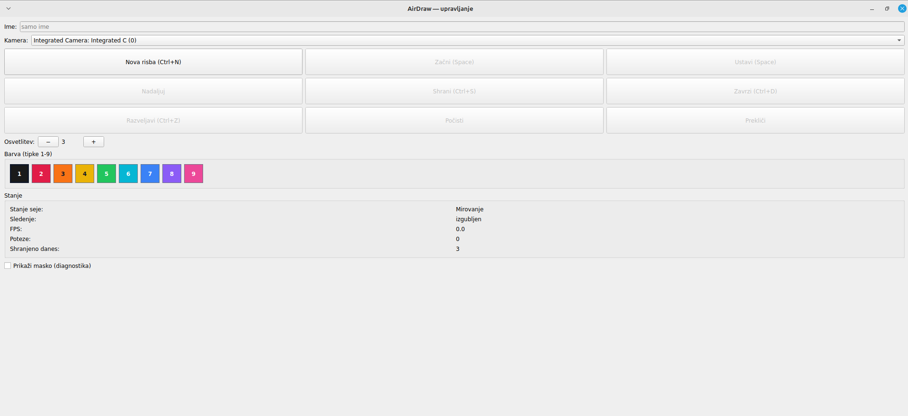
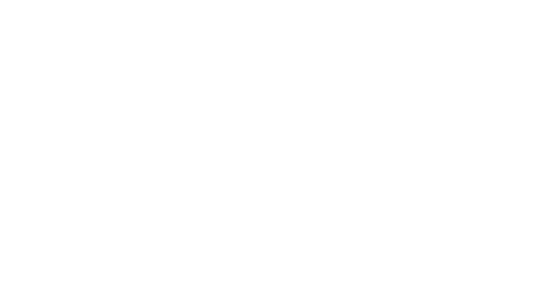
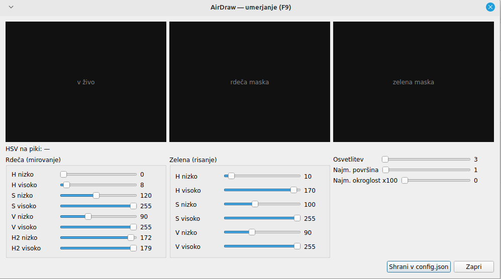

# Zrakoris — risanje po zraku

Aplikacija za stojnico na Incastra sejmu. Uporabnik maha s svetlečo
paličico po zraku, spletna kamera sledi LED lučki, aplikacija pa poteze izriše
na belo platno, prikazano na televizorju. Operater vodi seje z računalnika,
vsaka risba pa se shrani kot slika PNG in kot ponovljiva datoteka potez (JSON), ki jo lahko ustvarimo v GIF.

<!--  -->

---

## Kazalo

1. [Kako deluje](#kako-deluje)
2. [Oprema](#oprema)
3. [Namestitev](#namestitev)
4. [1. korak: preveri kamero](#1-korak-preveri-kamero)
5. [Zagon aplikacije](#zagon-aplikacije)
6. [Delo operaterja](#delo-operaterja)
7. [Umerjanje (F9)](#umerjanje-f9)
8. [Nastavitve — `config.json`](#nastavitve--configjson)
9. [Kam se shranjujejo risbe](#kam-se-shranjujejo-risbe)
10. [Izdelava programa `.exe`](#izdelava-programa-exe)
11. [Pomožna orodja](#pomožna-orodja)
12. [Odpravljanje težav](#odpravljanje-težav)
13. [Zasebnost](#zasebnost)
14. [Za razvijalce](#za-razvijalce)

---

## Kako deluje

Ključno tehnično dejstvo: ** LED lučka, usmerjena v kamero, se snema kot bela.** Senzor se v sredini
lučke zasiči. Rešitev je **ročna nastavitev osvetlitve (exposure) na zelo nizko
vrednost**: prostor postane skoraj črn, v sliki ostane samo LED lučka v
pravi barvi. To hkrati odpravi lažne zaznave (rdeča oblačila, odsev oken), zato aplikacija deluje tudi brez temnega ozadja.

Barvna zasnova:

| Barva LED | Pomen |
|---|---|
| **rdeča** | mirovanje — kazalec sledi, a se ne riše |
| **zelena** | gumb pritisnjen — riše se poteza |

Cevovod obdelave slike (v `core/tracker.py`, brez Qt): zrcali sliko → obreže na
območje zanimanja (ROI) → zamegli → pretvori v HSV → prag za obe barvi →
morfološko odpiranje → poišče kandidatne pike → izbere eno piko z *omejenim
iskanjem najbližjega soseda* → določi stanje, preslika v koordinate platna,
zgladi z **One-Euro filtrom**.

<!--  -->

---

## Oprema

| Kos | Podrobnosti |
|---|---|
| Paličica | Ena. Dve LED lučki za razpršilcem (npr. pingpong žogica). **Rdeča = mirovanje, zelena = gumb držan.** Nikoli obe hkrati (mešanica = rumena → zavrnjeno kot šum). |
| Kamera | Zunanja USB spletna kamera (UVC). **Mora podpirati ročno osvetlitev.** Vgrajene kamere prenosnikov pogosto ne. |
| Zaslon | Prenosnik → HDMI → TV. Razširjen zaslon, **ne** zrcaljen. |
| Računalnik | Prenosnik, Windows ali Linux. |

Priporočljivo: vsaj ena rezervna sestavljena paličica in rezervne baterije.
Na TV vklopi **igralni način / način PC** (zmanjša zakasnitev za 50–120 ms).

---

## Namestitev

```bash
python -m venv venv
source venv/bin/activate        # Windows: venv\Scripts\activate
pip install -r requirements.txt
```

Python 3.10 ali novejši.

---

## 1. korak: preveri kamero

**Preden kar koli drugega** preveri, da kamera dejansko posluša ročno
nastavitev osvetlitve:

```bash
python tools/record_clip.py --check
```

Izpiše se tabela zahtevanih in dejanskih vrednosti, nato pa slika v živo.

- Na **Linuxu (V4L2)** mora `auto_exposure` pokazati **1** (1 = ročno, 3 =
  samodejno). `exposure` je v enotah ~100 µs, tipično 1–2000.
- Na **Windows (DirectShow)** je `auto_exposure` 0.25 (ročno), `exposure` pa
  logaritemska lestvica od −6 do −10.

V oknu v živo:

| Tipka | Dejanje |
|---|---|
| `+` / `-` | povečaj / zmanjšaj osvetlitev |
| `a` | preklopi samodejno osvetlitev |
| `q` | izhod |

S tipko `-` znižuj osvetlitev, dokler prostor ne postane skoraj črn in ostane
samo LED lučka. Odčitek naj kaže: **rdeča → H okoli 0 ali 179, S ≥ ~120**;
ob pritisku gumba **zelena → H okoli 50–75**. Če piše »SATURATING«, je
osvetlitev previsoka — še zniža.

Ko najdeš dobro vrednost, jo prepiši v `config.json` (`camera.exposure`).
Program to vrednost izpiše ob vsakem pritisku.

Če sprememba osvetlitve **nima nobenega učinka**, kamera ignorira nastavitve —
zamenjaj kamero. Na Linuxu preveri z `v4l2-ctl -d /dev/video0 --list-ctrls`.

<!--  -->

---

## Zagon aplikacije

```bash
python main.py                       # običajni zagon (dva zaslona)
python main.py --config venue.json   # druga datoteka z nastavitvami
python main.py --no-tv               # razvojni način na enem zaslonu
python main.py --video posnetek.mp4  # predvajaj posnetek namesto kamere
python main.py --mouse --no-tv       # miška namesto paličice (za preizkus logike)
python main.py --kiosk               # onemogoči Esc in razvojne bližnjice
```

Odpreta se **dve okni**:

- **Platno** (za TV, zaslon 2): brez okvirja, čez cel zaslon. Samo belo platno
  in kazalec. Nobenega besedila ali imena. V mirovanju kratko vabilo in bledeče
  poteze (»attract«).
- **Nadzorna plošča** (za operaterja, na prenosniku): ime, veliki gumbi,
  stanje, števec potez, števec risb za današnji dan, diagnostični pregled maske.





---

## Delo operaterja

Potek ene seje:

1. **`Ctrl+N`** — nova seja. Vpiši **samo ime** uporabnika (ali pusti prazno).
2. **`Preslednica`** — začni risanje. Zdaj se poteze zapisujejo.
3. Uporabnik riše. Ob napaki **`Ctrl+Z`** odstrani zadnjo potezo (najbolj
   uporabljena funkcija!).
4. **`Preslednica`** — ustavi. Platno zamrzne (pregled).
5. **`Ctrl+S`** — shrani in nazaj v mirovanje, ali **`Ctrl+D`** — zavrzi.

### Bližnjice

| Tipka | Dejanje |
|---|---|
| `Ctrl+N` | nova seja |
| `Preslednica` | začni / ustavi (in nadaljuj iz pregleda) |
| `Ctrl+Z` | razveljavi zadnjo potezo |
| `Ctrl+S` | shrani in nazaj v mirovanje |
| `Ctrl+D` | zavrzi |
| `1`–`9` | izberi barvo poteze iz palete |
| `F9` | umerjanje |
| `Esc` | izhod iz celozaslonskega načina (samo razvoj; onemogočeno z `--kiosk`) |

### Gumbi

Poleg prenosnih gumbov (Nova risba / Začni / Ustavi / Nadaljuj / Shrani /
Zavrzi / Razveljavi / Počisti / Prekliči) ima plošča:

- **Kamera** (spustni seznam) — izbere napravo za zajem. Našteje **vse** kamere,
  ki jih OpenCV lahko odpre; naprava, ki se je odprla, a ni poslala slike, je
  označena z »— no signal?« (tak je npr. drugi vozel UVC kamere). Vgrajene
  kamere prenosnikov se pogosto pojavijo šele tu — če je pravi vnos videti kot
  »no signal?«, ga vseeno poskusi izbrati. Preklop ne zahteva ponovnega zagona.
- **Osvetlitev − / +** — hitra prilagoditev osvetlitve **brez** odpiranja
  umerjanja. Skozi dan baterija paličice pojema, LED potemni; z enim klikom
  popraviš, ne da bi izgubil pogled na platno.
- **Prikaži masko (diagnostika)** — pokaže rdečo/zeleno masko v živo; neprecenljivo
  za sprotno diagnostiko sledenja.

### Barva poteze

Na nadzorni plošči je vrstica barvnih gumbov **Barva (tipke 1-9)**. Klik na gumb
ali pritisk ustrezne številke `1`–`9` izbere barvo, s katero se rišejo **naslednje
poteze**. Trenutno odprta poteza obdrži svojo barvo — sprememba velja šele od
naslednjega poteza naprej. Izbrani gumb je označen.

Barve so nastavljene v `config.json` pod `stroke.palette` (do 9 vrednosti, zapis
`#rrggbb`); `stroke.color` je barva ob zagonu aplikacije. Izbrana barva ostane
tudi čez `Ctrl+N` (nova seja) — velja, dokler je operater ne zamenja.

Priporočena raba na prizorišču: operater med risanjem menja barve po dogovoru z
uporabnikom (npr. »zdaj pritisni gumb, narisal bom obrobo v modri« → operater
pritisne `7`). Uporabnik palete ne vidi in ne upravlja.

### Stanja seje

| Stanje | Se riše na platno | Opomba |
|---|---|---|
| Mirovanje | samo »attract« | vabilo; poteze zbledijo in se ne shranijo |
| Vnos imena | ne | operater vpiše ime |
| Risanje | **da** | edino stanje, ki zapisuje poteze |
| Pregled | ne | platno zamrznjeno; shrani / zavrzi / nadaljuj |
| Umerjanje | ne | dosegljivo od kjer koli, vrne se v prejšnje stanje |

**Kazalec se premika v vseh stanjih.** Uporabniki primejo paličico, preden je
operater pripravljen — zaslon se mora odzivati, sicer deluje pokvarjeno.
Zapisuje se le v stanju »Risanje«.

Če v risanju `idle_timeout_s` sekund ni zaznave, se **na nadzorni plošči**
(nikoli na TV) pokaže rumeno opozorilo »naj zaključim sejo?«. Seja se ne
konča sama.

---

## Umerjanje (F9)

`F9` iz katerega koli stanja. Uporablja se z vrsto uporabnikov, ki medtem čakajo. Vsebuje:

- sliko v živo ob obeh binarnih maskah (rdeča, zelena),
- drsnike H/S/V (spodnja in zgornja meja) za vsako barvo — rdeča ima dva para H
  (odtenek se ovije okoli 0),
- drsnik osvetlitve,
- drsnika najmanjše površine in najmanjše okroglosti pike,
- odčitek vrednosti HSV v središču zaznane pike,
- gumb **Shrani v config.json**.

Ob zaprtju se aplikacija vrne v točno tisto stanje, iz katerega si prišel;
uporabnikova risba ostane nedotaknjena.



---

## Nastavitve — `config.json`

Datoteka se prebere ob zagonu in jo prepiše umerjanje. Leži poleg programa
(oz. v korenu repozitorija pri zagonu iz izvorne kode). Pričakuj, da se bo vsaka
vrednost na prizorišču spremenila.

| Ključ | Pomen |
|---|---|
| `camera.index` | zaporedna številka kamere (0, 1, …) |
| `camera.exposure` | osvetlitev; Linux ~1–2000, Windows −6…−10 |
| `camera.auto_exposure` | 0.25 = »želim ročno« (program prevede za V4L2 v 1) |
| `camera.auto_wb` | 0 = izklop samodejne bele svetlobe (nujno) |
| `roi` | območje zanimanja v slikovnih pikah kamere; **razmerje stranic mora ustrezati platnu** (16:9), sicer krogi postanejo elipse |
| `colors.idle` / `colors.draw` | HSV-obsegi za rdečo in zeleno; rdeča ima dva obsega |
| `blob.min_area` / `max_area` | velikostni filter pike |
| `blob.min_circularity` | 0–1; razpršena žogica je okrogla, odsev cevi ni |
| `blob.gate_px` | koliko pik od zadnjega položaja še sme biti nova pika (v pikah ROI) |
| `smoothing.min_cutoff` | nižje = manj tresenja mirujočega kazalca |
| `smoothing.beta` | višje = manj zaostajanja za hitro roko |
| `stroke.start_frames` | koliko zaporednih zelenih zaznav odpre potezo (prepreči pike ob utripu) |
| `stroke.end_frames` | koliko zaporednih ne-zelenih zaznav zapre potezo (prepreči drobljenje krivulj) |
| `stroke.max_jump_px` | večji skok od tega = izguba sledenja, poteza se zapre (v pikah platna) |
| `stroke.width` | debelina poteze |
| `stroke.color` | privzeta barva poteze ob zagonu (`#rrggbb`) |
| `stroke.palette` | do 9 barv za gumbe / tipke `1`–`9` na nadzorni plošči |
| `canvas.w` / `canvas.h` | ločljivost platna (neodvisna od TV) |
| `session.idle_timeout_s` | po tolikšnem mirovanju opozorilo operaterju |
| `session.attract_fade_s` | čas bledenja »attract« potez v mirovanju |
| `output.dir` | mapa za shranjevanje (relativno = poleg programa) |
| `output.print_enabled` | tiskanje ob shranjevanju (privzeto izklop) |
| `ui.language` | `sl` ali `en` — jezik vmesnika |

Ključi s podčrtajem na začetku (npr. `_kiosk`) so samo za tekoči zagon in se
**nikoli ne shranijo** nazaj v datoteko.

---

## Kam se shranjujejo risbe

```
output/2026-09-12/
├── index.csv
├── 0001_marek/
│   ├── drawing.png
│   └── session.json
└── 0002/               ← brez imena
    ├── drawing.png
    └── session.json
```

- Ime se očisti na `[a-z0-9_]`, skrajša na 24 znakov in dobi predpono z
  zaporedno številko dneva. Brez imena je mapa samo `0002`.
- `session.json` vsebuje vse poteze; tretji element vsake točke je **čas v
  sekundah od začetka te poteze** — to omogoča `render_gif.py`, da predvaja z
  resnično hitrostjo.
- `index.csv`: `session_id,name,started_at,ended_at,stroke_count,point_count,printed`
- Vse datoteke se pišejo prek začasne datoteke in `os.replace` — nenaden izklop
  prenosnika ne pusti napol zapisane datoteke.

---

## Izdelava programa `.exe`

Operater dobi **eno samo datoteko**, brez potrebe po Pythonu. Zgradi jo **na
ciljnem operacijskem sistemu** (PyInstaller ne zna prevajati za drug OS —
Windowsovo različico je treba zgraditi na Windowsu):

```bash
pip install -r requirements-dev.txt
pyinstaller airdraw.spec --noconfirm
```

Nastane `dist/AirDraw.exe` (Windows) oz. `dist/AirDraw` (Linux). Ob prvem
zagonu si program poleg sebe ustvari `config.json` in mapo `output/`. Tehnik
enkrat umeri kamero prek zaslona **F9** (Shrani zapiše nazaj v ta `config.json`)
— ponovna gradnja ni potrebna.

Skripte v `tools/` se **ne** vključijo v `.exe`; ostanejo kot skripte za
pripravo na prizorišču na računalniku s Pythonom.

Ob zaprtju nadzorne plošče se zapre tudi okno platna in ustavijo vse niti.

---

## Pomožna orodja

Vsa so samostojna in ne odpirajo Qt vmesnika.

```bash
# posnemi surov video na prizorišču za kasnejše umerjanje
python tools/record_clip.py --seconds 300 --out venue_clip.mp4

# poženi sledilnik čez posnetek in prekrij zaznavo (umerjanje na kavču)
python tools/replay_overlay.py venue_clip.mp4
#   presledek = pavza/korak,  [ / ] = korak nazaj/naprej,  q = izhod

# session.json → animiran GIF (na koncu dneva)
python tools/render_gif.py output/2026-09-12/0001_marek/session.json \
    --width 600 --fps 20 --speed 1.5 --hold 1.5
python tools/render_gif.py --all output/2026-09-12     # cel dan naenkrat
```

---

## Odpravljanje težav

| Znak | Verjeten vzrok | Rešitev |
|---|---|---|
| LED se vidi kot bela, odtenek nesmiseln | previsoka osvetlitev | zniža `camera.exposure`; **ne** nižaj praga S |
| sprememba osvetlitve nima učinka | kamera ignorira nastavitve | Windows: uporabi `CAP_DSHOW`; Linux: `v4l2-ctl --list-ctrls`; zamenjaj kamero |
| kazalec vse bolj zaostaja | kopičenje slik v medpomnilniku | `cap.set(CAP_PROP_BUFFERSIZE, 1)` (že v kodi) |
| stalna zakasnitev ~150 ms | obdelava slike na TV | vklopi igralni način na TV |
| risba je zrcaljena | manjka zrcaljenje | `cv2.flip(frame, 1)` v niti zajema (že v kodi) |
| krogi so elipse | razmerje ROI ≠ razmerje platna | popravi `roi` |
| naključne poteze čez ves prostor | tuja svetloba v ROI | zoži ROI; zvišaj `min_circularity`; preveri odseve |
| črta skoči čez platno | izguba sledenja ni zavrnjena | zniža `stroke.max_jump_px` |
| gladke krivulje se drobijo | prekratek `end_frames` | zvišaj `stroke.end_frames` |
| pike ob pritisku gumba | prekratek `start_frames` | zvišaj `stroke.start_frames` |
| kazalec trese med mirovanjem | previsok filter | zniža `smoothing.min_cutoff` |
| poteze zaostajajo za roko | filter se ne prilagaja dovolj hitro | zvišaj `smoothing.beta` |
| sledenje slabša skozi ure | upadanje baterije, LED slabi | zamenjaj paličico; z gumbom Osvetlitev + ali v F9 zniža spodnjo mejo V |
| paličica deluje mrtvo | obe LED hkrati → rumena, zavrnjeno | popravi vezje paličice na strogo »ali-ali« |
| dolga črta po »Nadaljuj« | poteza ni bila zaprta ob menjavi stanja | (že rešeno v kodi) |
| shranjena PNG ima piko | kazalec vrisan v sliko | (že rešeno — kazalec se riše le v `paintEvent`) |

---

## Zasebnost

**Ne zbiramo e-poštnih naslovov.** Osebni podatki uporabnikov so strogo urejeni
(GDPR). Za enodnevno stojnico:

- zberi **samo ime**, uporabljeno le kot oznaka datoteke,
- risbo izroči takoj (termalni tiskalnik ali QR koda na zaslonu),
- imena nikoli ne prikaži na TV,
- ob koncu dneva mapo `output/` izbriši ali izroči organizatorju in odstrani z
  računalnika.

Če starš želi kopijo po e-pošti, to zapiši na papir in pošlji ročno kasneje —
zunaj aplikacije. Aplikacija, ki e-naslova nikoli ne shrani, ga ne more razliti.

---

## Za razvijalce

Struktura:

```
core/     cevovod obdelave slike (tracker, filters — brez Qt), podatkovni model,
          stanjski avtomat seje (session), shranjevanje (storage), poti (paths)
ui/       nadzorna plošča, celozaslonsko platno, umerjanje, prevodi (strings.py)
tools/    record_clip, replay_overlay, render_gif  (vsi samostojni)
tests/    pytest za jedro brez Qt + brezglavi test celotne povezave
```

`core/tracker.py` in `core/filters.py` **ne uvažata Qt** — celoten cevovod se
lahko razvija in umerja proti posnetku brez kamere in brez vmesnika.

Testi:

```bash
QT_QPA_PLATFORM=offscreen python -m pytest -q
```

Jezik vmesnika: vsi nizi so v `ui/strings.py` (stolpca `sl` / `en`).
